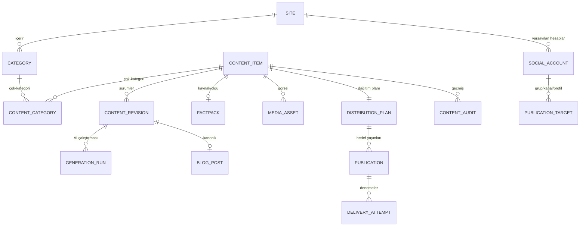
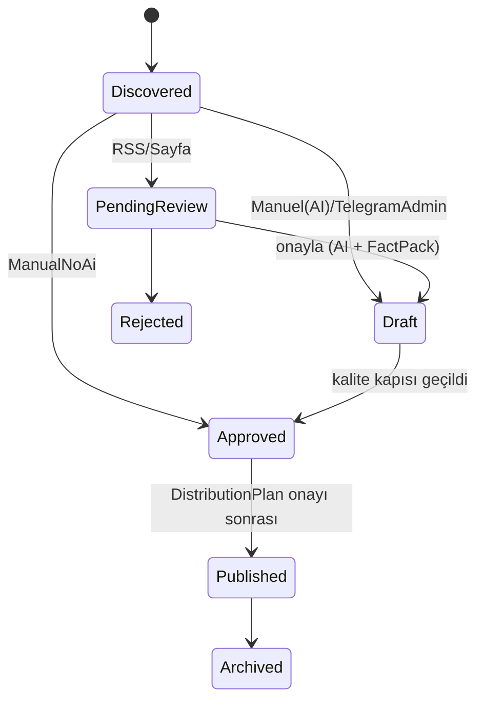

# İçerik Otomasyon Platformu — Mimari Plan (v6)

> Dikey (niş) odaklı, yapay zekâ destekli, denetlenebilir bir dijital yayın işletim sistemi.
> Kaynaklardan (RSS / sayfa / manuel / admin Telegram grubu) içerik toplar, **doğrular ve onaylatır**,
> AI ile **değer katan** içerik + görsel üretir, SEO odaklı blog’da yayınlar ve dağıtım planına göre
> Telegram / X / Instagram / Threads hedeflerine **zamanlanmış** dağıtır; reklam ve topluluk yönetimini
> tek çatı altında toplar. Her adımın kim/ne zaman/nereden/nereye geçmişini tutar.
>
> **v4 notu:** Bu sürüm, harici mimari incelemesindeki (ChatGPT) geçerli düzeltmeleri içerir.
> Ana değişiklikler: `Site/Brand` ayrımı, `ContentRevision + GenerationRun`, editoryal/medya/yayın
> durumlarının ayrılması, `DistributionPlan`, `PublicationTarget + DeliveryAttempt`, `FactPack`,
> `ContentQualityGate`, kaynak telif + SSRF sertleştirmesi, reklamın iç/dış ayrımı, SEO iddialarının
> düzeltilmesi, düzeltilmiş maliyet. **MVP bilinçli olarak yalın tutulur; ağır parçalar fazlara yayılır.**
>
> **v5 notu:** Operasyonel güvenilirlik katmanı eklendi (§27) — içerik tazeliği/son kullanma, granular acil
> durdurma, TestMode + platform önizleme, dead-letter manuel replay, maliyet devre kesici, semantik tekrar
> algılama, prompt sürümleme, model yönlendirme, UTM/link takibi, kaynak sağlık + selector bozulma, içerik
> şablonları, yazar profilleri, RBAC-lite, yedekleme ve veri saklama. Güvenlik-kritik olanlar MVP’ye alındı;
> topluluk/gelir/çok-dil katmanları fazlara bırakıldı. §28’de öncelik sırası var.
>
> **v6 notu:** Reklam tarafı baştan yapılandırıldı (§14) — **Monetization (para kazandığımız) ile Promotion
> (para harcadığımız) ayrı sistemler**; `TrackingOwner` (kendi `/r/{id}` yalnız kendi reklamımızda),
> `MonetizationEligibility` (otomatik içerik + AdSense riski), teşvikli trafik yasağı + `TrafficQuality`
> (TrueNetwork puan sistemine karşı duvar), `AdPlacement`, CMP/ads.txt, sponsorlu makale vs affiliate ayrımı,
> **dört ayrı Telegram reklam türü**, `AdPacingPolicy` (EveryNPosts yerine), reklamveren doğrulama, envanter/paket,
> `RevenueLedger`. Ayrıca **görselde 3. seçenek: “Ben yükleyeceğim”** (§9) — metinler AI’dan gelir ama görsel elle
> yüklenene kadar içerik sıraya girmez/yayınlanmaz.

---

## 0. İçindekiler
1. Vizyon ve Kapsam Disiplini · 2. Teknoloji · 3. Mimari + Bağlamlar · 4. Klasör Yapısı ·
5. Alan Modeli (Site→Category→Content) · 6. Durum Ayrımı · 7. Girdi + FactPack ·
8. Üretim (ContentRevision/GenerationRun, token-minimal) · 9. Görsel · 10. Kalite & Risk Kapısı ·
11. Dağıtım (DistributionPlan/PublicationTarget/DeliveryAttempt) · 12. Zamanlama · 13. Blog & SEO ·
14. Reklam & Gelir (Monetization/Promotion) · 15. Telegram Grup + Rozet · 16. Admin Telegram Grubu ·
17. Düzeltme/Geri Çekme · 18. Kimlik & Token Yenileme · 19. Denetim & Observability ·
20. Güvenlik (SSRF, sanitizasyon, telif) · 21. Admin Paneli · 22. Worker İşleri ·
23. Faz Yol Haritası (yeniden dengeli) · 24. Ürün & Gelir Stratejisi · 25. Maliyet (düzeltilmiş) ·
26. İncelemeden alınan/ayrılan kararlar · 27. Operasyonel Güvenilirlik Katmanı · 28. Öncelik Sırası

---

## 1. Vizyon ve Kapsam Disiplini

Sistem teknik olarak beş şeyi birden yapabilir (haber sitesi, sosyal otomasyon, Telegram topluluk, reklam platformu, ileride SaaS). **Ama hepsini aynı anda kurmak MVP’yi boğar.** Bu yüzden v4’ün ilkesi: **motoru doğru tasarla, vagonları fazlara yay.**

| İlke | Açıklama |
|---|---|
| **Dikey odak** | “Her konuda otomatik haber” yerine belirli bir dikeyde (§24) değer katan yayın. |
| **Onay-önce, AI-sonra** | Ham içerik onaya düşer; AI yalnız onaylanan/güvenilir girdide çalışır. |
| **Değer kapısı** | Sadece yeniden yazım değil; “ne değişti, kimi etkiler, son tarih, ne yapmalı” eklenir (§10). |
| **Durumları ayır** | Editoryal ≠ Medya ≠ Yayın durumu (§6). Tek kanal patlayınca içerik “başarısız” sayılmaz. |
| **Tek doğruluk kaynağı** | “Ne nereye gidecek?” sorusunu `DistributionPlan` yanıtlar (§11). |
| **İzlenebilirlik** | FactPack + Audit + PayloadSnapshot: her bilgi ve her yayın geriye izlenebilir. |
| **Maliyet şeffaf** | Tavan yok; harcama istatistiği + konfigüre edilebilir `ModelCatalog` (§25). |
| **Yalın MVP** | §23’teki MVP subseti; ağır parçalar (DistributionPlan, community, çoklu platform) sonra. |

---

## 2. Teknoloji
`.NET 10 (LTS, destek 2028’e dek)`, ASP.NET Core Minimal API, EF Core 10, **PostgreSQL** (JSONB), **Redis** (kuyruk/sayaç/rate-limit), **Quartz.NET**, **SkiaSharp** (kart) + OpenAI Images (düşük kalite), OpenAI metin (konfigüre model), **HtmlSanitizer** (yorum + içe aktarılan + AI HTML), **Data Protection/KMS** (token şifreleme), Admin **SPA** (`wwwroot/admin`), Blog **SSR** (Razor/MVC veya Next.js), **Object storage (S3)+CDN** (görseller), **OpenTelemetry** (izleme).
Devralınan: `XApiClient` (OAuth 1.0a), IG/Threads adaptörleri, Telegram broadcasting + `BroadcastGuard`, `Community` kart/liderlik, `SystemSetting`/admin deseni, `Ads`/`Campaign` iskeleti.

---

## 3. Mimari + Bağlamlar

Modular Monolith + Clean Architecture. **Modül patlamasını önlemek için** modüller beş **bağlam (bounded context)** altında gruplanır; kod içinde sınır korunur, ama başlangıçta bağlam başına tek `DbContext` yeterlidir:

| Bağlam | İçindeki modüller |
|---|---|
| **Ingestion** | Sources, FactPack çıkarımı, dedup |
| **Editorial** | Content, ContentRevision, GenerationRun (AiContent), QualityGate, Media |
| **Publishing** | DistributionPlan, PublicationTarget, Publishing adaptörleri, Ads |
| **Site** | Blog, SEO, Comments |
| **Platform** | SocialAccounts+Token, Community, AdminInbox, Audit, Notifications, Admin, Sites/Brands |

Bağlamlar arası: Contracts + Integration Event. İleride bir bağlam gerçekten gerekirse ayrı servise çıkarılabilir.

---

## 4. Klasör Yapısı
```
src/
  Host/ ContentPlatform.Api/ (blog SSR + admin API + SPA)  ContentPlatform.Worker/ (Quartz)
  Contexts/
    Ingestion/  {Sources, FactPack}
    Editorial/  {Content, Generation, Quality, Media}
    Publishing/ {Distribution, Targets, Channels, Ads}
    Site/       {Blog, Seo, Comments}
    Platform/   {Sites, SocialAccounts, Community, AdminInbox, Audit, Notifications, Admin}
  Shared/  Shared.Contracts/
  Assets/  (font, logo, kart şablonları)
```

---

## 5. Alan Modeli (Site → Category → Content)

### 5.1 Hiyerarşi



### 5.2 Site/Brand (yeni)
Marka/site düzeyi sorumluluklar kategoriden ayrıldı: `Id, Domain, BrandName, Logo, DefaultLanguage, TimeZone, Theme, PublisherName, DefaultAuthor, LegalPages, CookiePolicy, AnalyticsSettings, SearchConsoleSettings, DefaultSocialAccounts, AdSettings`.
**Reklam/uyum alanları (§14.6):** `AdsTxtContent, CmpProvider, ConsentMode, PersonalizedAdsEnabled, PrivacyPolicyUrl, CookiePolicyUrl, AdSensePublisherId, AdSenseStatus, LastPolicyCheckAt`.
> İkinci bir alan adı/marka açıldığında kategori tablosu şişmez. MVP’de tek Site.

### 5.3 Category
`Id, SiteId, Name, Slug, Language?, IsActive, ImageMode(AiImage|SkiaCard|Auto), DefaultAiImage, AdEveryNPosts, RssAutoApprove, DefaultRiskLevel` + `CategorySettings`(JSONB: ton, hashtag havuzu, kart teması). Marka ayarları Site’tan miras alınır.

### 5.4 CategoryAccount + SchedulePolicy
`CategoryId, SocialAccountId, SchedulePolicyId, IsEnabled`. Zamanlama artık zengin bir politika (§12), çıplak saat listesi değil.

### 5.5 ContentItem
`Id, Origin(Rss|WebPage|Manual|ManualNoAi|TelegramAdmin), UseAi, ImageSource(Ai|SkiaCard|Manual), RiskLevel(Low|Medium|High), EditorialStatus, MediaStatus, SourceHash(UNIQUE), CreatedByType, CreatedByRef, ApprovedByRef?, PublishedAt?`.
`ContentCategory` ara tablo: `ContentItemId, CategoryId, IsPrimary`.

### 5.6 ContentRevision (AI ve manuel — ortak)
`Id, ContentItemId, RevisionNumber, IsCurrent, Title, BodyHtml, MetaDescription, PlatformCaptions(JSONB: {x, instagram, telegram, threads}), Tags[], PrimaryKeyword, ImageAltText, CreatedBy, CreatedAt`.
> İçerik ile AI üretimi artık **yapışık değil**. Manuel içerik de aynı yapıyı kullanır; düzenleme yeni bir revizyon oluşturur (geçmiş korunur).

### 5.7 GenerationRun (AI çalıştırması)
`Id, ContentRevisionId, Provider, Model, PromptVersion, InputTokens, OutputTokens, CostUsd, RequestId, RawResponse, StartedAt, CompletedAt, Error?`.
> Her AI çağrısının tam kaydı: model, token, maliyet, ham cevap. Yeniden üretimler ayrı `GenerationRun` olur.

### 5.8 FactPack (kaynak & olgu katmanı — yeni)
`Id, ContentItemId, SourceUrl, SourceTitle, Publisher, PublishedAt, RetrievedAt, ExtractedClaims[], NamedEntities[], Dates[], DirectQuotes[], Confidence, SourceTrustLevel, ConflictingSources[], AttributionRequirement`.
> AI’a ham metin yerine FactPack verilir. Böylece kaynak kaybolsa bile neye dayanıldığı bilinir; tarih/isim uydurması yakalanır; “bu bilgiyi nereden aldık?” yanıtlanır. (MVP’de hafif sürüm: kaynak + çıkarılmış temel iddialar.)

### 5.9 MediaAsset
`Id, ContentItemId, Kind(AiImage|SkiaCard), Url, Width, Height, Bytes, TitleBurned`. webp, düşük çözünürlük (§9).

### 5.10 SocialAccount + PublicationTarget (ayrıldı)
**SocialAccount** = kimlik/kanal hesabı: `Id, SiteId?, Platform, DisplayName, CredentialsEncrypted, TokenExpiresAt?, Status, LastError?, LastCheckedAt?`.
**PublicationTarget** = fiziksel hedef (bir bot onlarca gruba/kanala yayabilir): `Id, SocialAccountId, Platform, ExternalTargetId, TargetType(Group|Channel|Profile|Feed), Language?, TimeZone?, IsActive, Capabilities[], CharacterLimit, MediaRequirements`.

### 5.11 DistributionPlan + Publication + DeliveryAttempt
**DistributionPlan:** içeriğin kategorilerini toplar → hedefleri **tekilleştirir** → her platform için metin/görsel seçer → yayın saatini hesaplar → editöre gerçek önizleme → onayda `Publication` üretir. “Ne nereye” tek doğruluk kaynağı.
**Publication:** `Id, DistributionPlanId, ContentRevisionId, PublicationTargetId, DeliveryKind(FirstPost|Reminder|Correction), ScheduleOccurrenceId, Status(Pending|Scheduled|Processing|Published|Failed|Cancelled), PayloadSnapshot(JSONB: FinalText, FinalHashtags, FinalLink, MediaUrl, GeneratedAt, ContentRevisionId), ExternalId?`.
**UNIQUE**(ContentRevisionId, PublicationTargetId, DeliveryKind, ScheduleOccurrenceId).
**DeliveryAttempt:** `Id, PublicationId, AttemptNo, StartedAt, FinishedAt?, Outcome(Accepted|Failed|Unknown), ProviderResponse, Error?`.
> `Unknown` (istek gitti, cevap gelmedi) durumunda körlemesine tekrar **yapılmaz**; önce `ExternalId`/durum kontrol edilir (çift paylaşım önleme).

### 5.12 BlogPost + Comment
**BlogPost:** `Id, ContentRevisionId, PrimaryCategoryId, Slug(UNIQUE), Title, MetaDescription, BodyHtml, CoverImageUrl, CanonicalUrl, JsonLd, PublishedAt, Views, CommentsEnabled`.
**Comment:** `Id, BlogPostId, AuthorName, AuthorEmail?, Body(sanitize), Status(Pending|Approved|Rejected|Spam), IpHash, CreatedAt, ModeratedAt?`.

### 5.13 Reklam, Telegram etkileşim, Denetim → ilgili bölümlerde (§14, §15, §19).

---

## 6. Durum Ayrımı (önemli düzeltme)

Tek `Status` yetmez; üç eksen ayrılır:

- **EditorialStatus:** `Discovered → PendingReview → Draft → Approved → Published → Archived` (+ `Rejected`).
- **MediaStatus:** `NotRequired → Pending → AwaitingManualUpload → Ready → Failed`. (`AwaitingManualUpload` = “Ben yükleyeceğim” seçildi; içerik görsel gelene kadar sıraya girmez, §9.)
- **PublicationStatus** (hedef başına): `Pending → Scheduled → Processing → Published → Failed → Cancelled`.

> “Blog yayınlandı, Telegram yayınlandı, X başarısız, IG token hatası” → içerik **EditorialStatus=Published**; hata ilgili `Publication`/`DeliveryAttempt` seviyesinde. Ana içerik tek kanal yüzünden `Failed` olmaz.



---

## 7. Girdi + FactPack
| Kaynak | AI/Onay | Not |
|---|---|---|
| RSS | onay → AI | FactPack çıkarılır |
| WebPage | onay → AI | **özet+kaynak linki**; telif alanları + SSRF (§20) |
| Manuel (AI) | oto-onay → AI | |
| Manuel (AI’sız) | AI yok | bitmiş metin doğrudan revizyon |
| Admin Telegram grubu | AI taslak → gözden geçir | §16 |

Dedup: `SourceHash=hash(SourceUrl+normalize(Title))` (Redis+DB UNIQUE).

---

## 8. Üretim (token-minimal)
Tek çağrı, yapılandırılmış JSON: `{title, captions{x,instagram,telegram,threads}, bodyHtml, tags[], primaryKeyword, imageAltText}` — hepsi bir istekte, kısa promptla. FactPack girdi olarak verilir. Her çağrı bir `GenerationRun` (model/token/maliyet/ham cevap). `x`≤280, `instagram`≤2200; makale IG’ye uzunsa ayrı kısa caption. **Zamana duyarsız RSS toplu üretimi için OpenAI Batch API (%50 ucuz)** kullanılabilir. Model/fiyat **kodda sabit değil**, `ModelCatalog`’ta konfigüre.

---

## 9. Görsel — üç kaynaklı seçim (`ImageSource`)

Onay/ekleme anında görsel kaynağı **üç seçenekten** biri (`ContentItem.ImageSource`; kategori varsayılanı ön-işaretli):

| Seçenek | Ne olur |
|---|---|
| **AI** | ChatGPT düşük kaliteli editoryal görsel üretir. |
| **SkiaCard** | SkiaSharp ile başlık güzel formatta görsele basılır (kart teması, font/logo). |
| **Manual (“Ben yükleyeceğim”)** | **Metinler yine AI ile üretilir**, ama görseli sen yüklersin. İçerik `MediaStatus=AwaitingManualUpload`’ta bekler; **görsel yüklenene kadar sıraya girmez, DistributionPlan’a düşmez, yayınlanmaz.** Yükleyince `Ready` olur ve akışa devam eder. |

**Fallback:** `AI` seçilip görsel üretilemezse SkiaCard’a düşülür → görselsiz makale imkânsız. (`Manual`’da fallback yok; bilinçli olarak seni bekler.) Çıktı 1024² civarı düşük çözünürlük, **webp ~q70-75**; tek render → platform boyutları. Haber kartı/skor/liste/duyuru içeriklerinde SkiaCard zaten tercih.

`MediaStatus` bu yüzden bir değer kazanır: `NotRequired → Pending → AwaitingManualUpload → Ready → Failed`. Panelde “görsel bekleyen içerikler” listesi + yükleme butonu (§21).

---

## 10. Kalite & Risk Kapısı (yeni)

**ContentQualityGate** (yayından önce kontrol listesi): kaynak belirtilmiş mi? yeni bilgi/yorum eklenmiş mi? başlık içerikle uyumlu mu? tarih/isimler tutarlı mı? kaynaklar çelişiyor mu? sadece yeniden yazım mı? kullanıcıya özet/karşılaştırma/zaman çizelgesi/çıkarım sunuyor mu? riskli iddialar doğrulanmış mı?

**RiskLevel:** Düşük (eğlence, tarif, ürün duyurusu) / Orta (ekonomi, şirket haberi) / **Yüksek (sağlık, siyaset, kişisel finans/yatırım tavsiyesi, güvenlik)**. **Yüksek riskli içerik otomatik onaylanmaz** — her zaman insan onayı. (Kripto haberleri “yatırım tavsiyesi”ne kaymadan Orta’da tutulur.)

> Amaç: “özgünlük yüzdesi” değil, **değer üretimi**. Google’ın ölçekli-içerik-kötüye-kullanımı politikasına takılmamak için asıl kalkan budur.

---

## 11. Dağıtım
`DistributionPlan` (§5.11) merkez. Çok-kategori → hedef tekilleştirme (aynı X hesabı iki kategoride ise **tek** paylaşım). Her `PublicationTarget` kendi `Capabilities`/`CharacterLimit`/`MediaRequirements`’ını bildirir; adaptör “her platform aynı” varsaymaz. Outbox + `DeliveryAttempt` idempotency; kalıcı hata → alert. Harmanlayıcı: kanal sayacı `AdEveryNPosts`’a ulaşınca reklam slotu (iç kampanya → yoksa dış ağ).

---

## 12. Zamanlama — SchedulePolicy (zengin)
`TimeZoneId, AllowedDays, PostTimes, QuietHours, MinimumGapMinutes, DailyLimit, BacklogPolicy, HolidayExceptions, RandomJitterMinutes, MaxContentAge`.
> Çıplak `PostTimesLocal[]` yetmez: yaz saati, ülke farkı, **eskiyen haber** (`MaxContentAge`), spam görünmemek için jitter/min-gap, biriken kuyruk politikası burada. `ScheduledPostSlotJob` bu politikaya göre yayınlar.

---

## 13. Blog & SEO (düzeltilmiş)
- **URL:** kategori alt-dizin; subdomain yalnız ayrı markada. Site→kategori→yazı.
- **SSR şart.** On-page: benzersiz Title/Meta, canonical, OG/Twitter Card, JSON-LD Article+Breadcrumb, H1/H2, slug=`PrimaryKeyword`, görsel `alt`.
- **Etiket sayfaları** (`/etiket/<tag>`) + **otomatik iç linkleme** (ortak etiket/benzerlik).
- **Keşfe bildirim (düzeltme):** yeni URL’ler sitemap + `robots.txt` + **Search Console** + destekleyen motorlar için **IndexNow (Bing/Yandex vb.)** ile bildirilir. **İndeksleme garanti değildir; “anında indeksleme” denmez; indeks durumu izlenir.** (Google’ın eski sitemap-ping uç noktası kaldırıldı; Google IndexNow kullanmaz; Indexing API genel makale için değildir.)
- **FAQ/HowTo (düzeltme):** Google bu zengin sonuçları **kaldırdı**; schema eklenebilir ama “zengin sonuç getirir” vaadiyle yol haritasına konmaz.
- **Teknik:** webp+lazy+CDN, Core Web Vitals, blog RSS.
- **Yorumlar:** `Pending` → admin onayı; sanitize + spam sinyalleri.

---

## 14. Reklam & Gelir — Monetization vs Promotion (v6, yeniden yapılandırıldı)

Reklam artık tek `Ads` modülü değil. **İki taraf birbirinden tamamen ayrı** — birinde müşteri **bize** ödüyor, diğerinde **biz** platforma ödüyoruz. Aynı `AdCampaign` tablosunu paylaşmazlar; ayrı modül, ayrı tablo, ayrı muhasebe.

### 14.1 İki üst sistem
```
Monetization (para kazandığımız)          Promotion (para harcadığımız)
├── Advertisers                            ├── AcquisitionCampaigns
├── Inventory                              ├── Budgets
├── DirectCampaigns                        ├── Creatives
├── NetworkIntegrations                    ├── Targeting
├── Deliveries                             └── AcquisitionMetrics
├── RevenueLedger
└── Payouts
```
**Monetization:** blog AdSense/ağlar, blog banner satışı, sponsorlu makale, affiliate, Telegram resmi gelir paylaşımı, AdsGram kanal/bot/MiniApp, kendi Telegram sponsor postlarımız.
**Promotion:** Telegram Ads ile kendi kanalımızı büyütme, X/IG’de reklam verme, içerik tanıtımı, kullanıcı edinme.

### 14.2 Tıklama takibi — `TrackingOwner` (kendi `/r/{id}` yalnız kendi reklamımızda)
`/r/{id}` yönlendiricimiz **tüm** reklam türlerine uygulanamaz. `AdDelivery.TrackingOwner`: `Internal | Google | Telegram | AdsGram | AffiliateNetwork | ExternalProvider`.
| Reklam türü | Tıklama ölçümü |
|---|---|
| Doğrudan sponsor / kendi ürün / affiliate | `Internal` (`/r/{id}`) veya affiliate takip linki |
| Google AdSense | Google’ın kendi ölçümü — **asla `/r/{id}`’den geçirilmez** |
| Telegram resmi reklam | Telegram’ın ölçümü |
| AdsGram kanal/bot | AdsGram’ın ölçümü |
> Google reklamların değiştirilmesini, tıklamaya yönlendirmeyi ve yapay gösterim/tıklama üretmeyi yasaklar.

### 14.3 Blog reklam uygunluğu — `MonetizationEligibility` (KRİTİK)
Otomatik içerik (RSS+AI) + AdSense = hesap kapatma riski. Her yazıya **otomatik reklam açılmaz.** Per-post: `MonetizationEligibility(Pending|Eligible|Restricted|NotEligible|ManualReviewRequired)` + `CanShowProgrammaticAds, CanShowDirectAds, CanShowAffiliateLinks, SensitiveContent, AdExclusionReason`.
Reklam **alamayacak** içerikler: çok kısa RSS özeti, yeterince değiştirilmemiş kaynak, doğrulanmamış haber, düzeltme/hata sürecindeki içerik, yasal riskli içerik, yalnız görsel+birkaç cümle, ve yardımcı sayfalar (arama/giriş/hata/boş etiket).

### 14.4 Trafik kalitesi + teşvik yasağı (KRİTİK — TrueNetwork’e özel)
> **Kural (sert duvar):** AdSense bulunan sayfalara ziyaret veya reklam tıklaması karşılığında **hiçbir puan/rozet/ödül/hak verilmez.** TrueNetwork veya Telegram topluluk görevleri bu blogun reklamlı sayfalarına yönlendirilemez.

Teşvikli görüntüleme/tık, bot, tekrarlı gösterim → geçersiz trafik → gösterim kısıtı/hesap kapatma. `TrafficQuality` katmanı: kaynak platform, bot şüphesi, tekrarlı oturum, aşırı hızlı ziyaret, şüpheli ülke/IP, referrer, kampanya kaynağı, ad-uygunluk. Şüpheli trafikte sayfa açılır ama **reklam kodu çalıştırılmaz.**

### 14.5 Blog yerleşimleri — `AdPlacement` (kod içinde sabit değil)
Yerleşimler: `Header, BelowIntroduction, InArticle1/2, Sidebar, AfterArticle, RelatedContent, CategoryPage, Homepage, MobileAnchor, DesktopRail`. Her biri: aktif/pasif, mobil/masaüstü, min içerik uzunluğu, max reklam sayısı, izinli sağlayıcı, kategori engeli, hassas içerik engeli, A/B grubu.
**Muhafazakâr başlangıç:** giriş öncesi reklam yok; kısa yazıda yalnız yazı sonu; uzun yazıda en fazla 1-2 yazı-içi; hakkımızda/gizlilik/iletişim/hata sayfalarında reklam yok; mobilde kaplama sınırlı; önce küçük trafik grubunda deney. AdSense Auto Ads körlemesine tam açık bırakılmaz.

### 14.6 CMP / gizlilik / ads.txt — `Site` kurulum sihirbazı
`Site`’a eklenen alanlar: `AdsTxtContent, CmpProvider, ConsentMode, PersonalizedAdsEnabled, PrivacyPolicyUrl, CookiePolicyUrl, AdSensePublisherId, AdSenseStatus, LastPolicyCheckAt`. AEA/BK/İsviçre’de kişiselleştirilmiş reklam için **sertifikalı CMP zorunlu**; `ads.txt` güçlü öneri (yetkisiz satıcıyı engeller). Kurulum sihirbazı: gizlilik/çerez politikası, tercih merkezi, onay kaydı, sağlayıcı listesi, saklama süresi.

### 14.7 Sponsorlu makale vs Affiliate (ayrı)
**SponsoredContent:** sponsor finanse eder; editoryal görünür ama açık **“Sponsorlu İçerik”** etiketi; sponsor onayı + editoryal onay **ayrı**; yayından kaldırma tarihi; içindeki ücretli linkler `rel="sponsored"`.
**AffiliateProgram / AffiliateConversion:** satış/kayıt başına; ağ + kampanya kimliği, komisyon oranı, dönüşüm penceresi, iade/iptal, tahmini/kesinleşmiş gelir. `AdCampaign`’e tıkıştırılmaz, ayrı tutulur.

### 14.8 Telegram reklamı — dört ayrı tür
1. **Telegram resmi gelir paylaşımı** (`TelegramOfficialRevenue`): %50, public kanalda 1.000+ abone şartı. **Biz yayınlamayız**; Telegram kendi arayüzünde gösterir. İzlenen: gelir/tahmini-kesin bakiye/çekim/para birimi/kanal eşleşmesi.
2. **AdsGram kanal reklamı** (`AdsGramChannelIntegration`): kanal AdsGram’a bağlanır, **AdsGram botu** admin olur ve reklamı **o** yayınlar; ilk 24s görüntüleme gelir üretir, 24s sonra silinir; yalnız public kanal; CPM. Alanlar: `ChannelId, IntegrationStatus, AdsGramBotIsAdmin, ModerationStatus, LastAdPublishedAt, LastAdDeletedAt, EstimatedRevenue, FinalRevenue, PayoutStatus`. **Harmanlayıcı AdsGram’ı içerik kuyruğundan çekip yayınlamaz.**
3. **AdsGram bot / Mini App** (`TelegramBotAdIntegration`, `MiniAppAdIntegration`): bot CPC; MiniApp reward/interstitial/task. Kanal reklamıyla aynı tabloya konmaz.
4. **Kendi sattığımız Telegram sponsor postu** (`DirectCampaign`): sponsor doğrudan bize öder; **bizim bot** yayınlar; metin/görsel/buton bizim sistemde; `/r/{id}` ölçüm; süre sonunda silinebilir; sponsora rapor. Platformun en değerli reklam türü olabilir.

### 14.9 Kanal vs Grup (reklam açısından)
Kanal: reklam/sponsor/yayın/görüntülenme · Tartışma grubu: topluluk/yorum/moderasyon · Bot: etkileşim/CPC · Mini App: reward/interstitial/task. Resmi gelir + AdsGram kanal ağırlıkla **public channel**. Gruba doğrudan sponsor postu atılabilir ama bu “reklam ağı” değil, **kendi DirectCampaign’imiz.**

### 14.10 `AdPacingPolicy` (EveryNPosts yetersiz)
Alanlar: `MaxSponsoredPostsPerDay, MinOrganicPostsBetweenAds, MinMinutesBetweenAds, AllowedHours, QuietHours, AllowedDays, BlockedCategories, BlockedSensitiveTopics, MaxAdSharePercent, AllowWeekend, DeleteAfterHours, PinDurationMinutes`.
Örnek: günde max 2 sponsor · aralarında min 3 organik + 4 saat · gece reklam yok · **afet/ölüm/saldırı/sağlık krizi içeriğinin yanında reklam yok** · reklam toplam yayının ≤%15’i.

### 14.11 Reklamveren güvenlik doğrulaması
`Advertiser`: `VerificationStatus, RiskLevel, CompanyName, Country, TaxInfo, BlockedReason, ApprovedCategories, RejectedCategories, LastReviewAt`. Her sponsor/link: domain yaşı, HTTPS, redirect zinciri, malware, marka taklidi, yasal bilgi, kripto/finans risk, yasaklı kategori, ülke uygunluğu. (Telegram reklam kuralları çıtası kendi sistemimize de.)

### 14.12 Envanter + rezervasyon + paket
`Inventory` slotları: blog üst/kategori banner, makale içi sponsor, sponsorlu makale, Telegram normal/sabit sponsor post, haftalık Telegram sponsorluğu, bülten sponsorluğu, çoklu platform paketi. Her biri: liste fiyatı, min fiyat, tahmini erişim, tarih, rezerve/satıldı, max kampanya, indirim, para birimi. **En iyi satış ürünü tek reklam değil paket** (ör. 1 sponsorlu makale + 2 Telegram postu + 1 haftalık banner + sosyal paylaşım).

### 14.13 `RevenueLedger` (gelir muhasebesi)
`GrossRevenue, NetworkFee, PlatformFee, Refund, TaxOrWithholding, NetRevenue, Currency, ExchangeRate, EstimatedAt, FinalizedAt, PaidAt, PayoutProvider, InvoiceStatus`. Telegram/AdsGram/AdSense/affiliate/direct gelirleri tek raporda gösterilir ama **muhasebe kayıtları ayrı**. Vergi sınıflandırmasını şirket yapısına göre mali müşavir belirler.

### 14.14 Fazlama
Bu artık “arada reklam paylaşan bot” değil, küçük bir **reklam satış + dağıtım + gelir yönetim sistemi.** MVP’de reklam yok/minimal. **Faz 3 (Monetization):** AdSense uygunluk + `AdPlacement` + CMP/ads.txt + AdsGram kanal + kendi Telegram sponsor postu + `RevenueLedger`. **Faz 4+ (Promotion + envanter/paket + sponsorlu makale/affiliate olgunlaşması).**

Kaynaklar: [AdSense Program Politikaları](https://support.google.com/adsense/answer/48182), [Publisher Politikaları](https://support.google.com/adsense/answer/9335564), [CMP zorunluluğu](https://support.google.com/adsense/answer/13554116), [ads.txt](https://support.google.com/adsense/answer/7532444), [rel=sponsored](https://developers.google.com/search/docs/crawling-indexing/qualify-outbound-links), [Telegram gelir paylaşımı](https://telegram.org/blog/monetization-for-channels), [AdsGram kanallar](https://docs.adsgram.ai/channels/), [AdsGram botlar](https://docs.adsgram.ai/bots/), [Telegram Ads](https://ads.telegram.org/getting-started)

---

## 15. Telegram Grup + Rozet (düzeltilmiş)
Bot privacy kapalı + admin. `PublicationTarget` (Group|Channel). Link auto-sil (whitelist), aktiflik (mesaj + admin ise reaksiyon — güncelleme türlerine abone), haftalık liderlik (SkiaSharp), kanal+bağlı tartışma grubu ile “gönderi içi yorum”.
**Rozet:** normal kullanıcı → **sistem-içi sanal rozet** (kartlarda/hitapta). **Native admin custom-title yalnız gerçek moderatör/yöneticide** kullanılır; normal kullanıcı sırf rozet için admin yapılmaz. (Rozet=sanal; unvan=admin; liderlik=görsel.)

---

## 16. Admin Telegram Grubu (mesajdan taslak)
Kapalı grup + admin botu (`AllowedUserIds`). Üye mesajı → `ContentItem(Origin=TelegramAdmin)` → FactPack + AI **taslak** (Title, X-caption, ana makale, IG-caption, Tags) → `Draft/ReviewDraft` → panelde hızlı düzenle/yeniden üret/onayla → görsel + DistributionPlan. Kategori mesajda etiketle (#kripto) veya panelden; çok-kategori mümkün.

---

## 17. Düzeltme / Geri Çekme (yeni)
`Corrections/Retractions`: `CorrectsContentId, SupersedesRevisionId, CorrectionReason, RetractedAt, RetractionReason, ExternalDeletionStatus`. Yanlış içerik yalnız blogdan kalkmaz; hangi platformda düzeltme/silme yapıldığı izlenir.

---

## 18. Kimlik & Token Yenileme (çekirdek)
IG/Threads uzun-ömürlü token ~60 günde dolar. Hesap ekleme ekranında token istenir, `TokenExpiresAt` gösterilir; `TokenRefreshJob` (günlük) süresi yaklaşanı yeniler; yenilenemezse hesap `Error` + admin bildirimi. Token’lar şifreli/maskeli.

---

## 19. Denetim & Observability
**ContentAudit:** `Event(Created|Approved|Rejected|Edited|Regenerated|Published|Failed|Retracted), Channel?, TargetId?, ActorType, ActorRef, Detail, At` — içerik başına tek zaman çizelgesi (kim/nereden/ne zaman/nereye).
**Observability:** OpenTelemetry + TraceId, job run history, **dead-letter queue**, platform hata oranı, son başarılı yayın, kuyruk yaşı, kaynak sağlık skoru, token yenileme başarısı, içerik başına gerçek maliyet.

---

## 20. Güvenlik (SSRF + sanitizasyon + telif)
- **Kaynak politikası alanları:** `UsagePolicy, AttributionRequired, AllowedContentLength, AllowImageReuse, CommercialUseAllowed, RobotsCheckedAt, TermsCheckedAt, BlockedReason, TakedownStatus`. “Özet+link” telifi otomatik çözmez; politika verisi tutulur.
- **URL çekme (SSRF sertleştirme):** yerel/metadata IP engeli, DNS-rebinding koruması, redirect sınırı, max dosya boyutu, MIME allowlist, istek timeout.
- **Sanitizasyon:** zararlı SVG/HTML temizliği; **AI’ın ve içe aktarılanın ürettiği HTML de** sanitize (yalnız yorum değil).
- Token şifreleme (Data Protection/KMS), admin auth + IP kısıt + opsiyonel 2FA, platform rate-limit (Redis), **KVKK/GDPR** (yorum e-posta/IP → gizlilik politikası, çerez onayı, saklama süresi).

---

## 21. Admin Paneli
Dashboard (onay bekleyen, bugün, hata, **bu ay AI harcaması**, gelir) · Onay Kuyruğu (ham, **görsel kaynağı: AI / SkiaCard / Ben yükleyeceğim**, toplu onay) · Taslaklar (düzenle/yeniden üret/onayla) · **Görsel Bekleyenler** (`AwaitingManualUpload` — görsel yükle → sıraya girer) · İçerik Ekle (AI / AI’sız, çok-kategori, görsel kaynağı) · İçerikler (+ zaman çizelgesi/düzeltme) · **Dağıtım Önizleme** (DistributionPlan: ne nereye, hangi metin/görsel/saat) · Siteler/Markalar (+ CMP/ads.txt/AdSense uyum) · Kategoriler · Kaynaklar (+ telif/robots) · Sosyal Hesaplar (+token son kullanım) · Hedefler (grup/kanal/profil, capabilities) · Telegram Grupları · Rozetler · Admin Grubu · **Monetization** (Advertisers/Inventory/DirectCampaigns/NetworkIntegrations/RevenueLedger/Payouts) · **Promotion** (AcquisitionCampaigns/Budgets/Metrics) · **Reklam Uygunluğu** (MonetizationEligibility + AdPlacement + TrafficQuality) · Blog/Etiket sayfaları · Yorum Moderasyonu · **Maliyet** (ModelCatalog + harcama) · Bildirimler/Observability.

---

## 22. Worker İşleri (Quartz)
`SourcePollJob`, `FactPackJob`, `PipelineDrainJob` (AI üretim), `QualityGateJob`, `DistributionPlanJob`, `ScheduledPostSlotJob` (SchedulePolicy), `OutboxDispatchJob` (+DeliveryAttempt), `AdPacingJob`, `WeeklyLeaderboardJob`, `TokenRefreshJob`, `AccountHealthJob`, `MetricsRollupJob`. Olay-güdümlü: Telegram link-sil/aktiflik/admin-grubu taslak.

---

## 23. Faz Yol Haritası (yeniden dengeli — platform bazında doğrula)

**MVP (gerçek trafik testi için yeterli):** Tek Site/Brand · 1-2 kategori · RSS + manuel · **insan onayı** · AI metin (token-minimal) · FactPack + QualityGate (hafif) · SkiaSharp kart · SSR blog · **Telegram kanal yayını** · Audit · basit maliyet paneli · retry + hata bildirimi · (sosyal eklenince) token yenileme.
**+ MVP operasyonel çekirdeği (§27’den):** içerik tazeliği/son kullanma · granular acil durdurma · TestMode + platform önizleme · dead-letter manuel replay · maliyet devre kesici (kaçak sensörü) · feature flag · kaynak sağlık + selector bozulma algılama · günlük yedekleme.

**Sonraki:** ContentRevisions tam · DistributionPlan · zengin SchedulePolicy · **X adaptörü** · e-posta bülteni · Telegram topluluk (link/aktiflik/rozet/liderlik) · AdminInbox · kaynak sağlık sistemi · analitik geri besleme.

**Trafik oluşunca (Monetization — §14):** blog AdSense (MonetizationEligibility + AdPlacement + CMP/ads.txt + TrafficQuality) · AdsGram kanal entegrasyonu · kendi Telegram sponsor postları (DirectCampaign) · RevenueLedger · Instagram + Threads · başlık/görsel A/B · çoklu site/marka.
**Sonra (Promotion + satış olgunlaşması):** Telegram Ads/X-IG ile kanal büyütme · sponsorlu makale + affiliate · envanter/rezervasyon/paket satışı · Payouts.

**Talep kanıtlanırsa:** Multi-tenant SaaS (hesaplar, kotalar, ödeme, özel alan adı, roller).

> Community + AdminInbox + X + Threads + Instagram + scraping’i **tek faza yığmak yerine platform bazında** doğrula.

---

## 24. Ürün & Gelir Stratejisi (öneri)

“Her konuda otomatik haber” teknik olarak çalışır ama Google’dan sürdürülebilir trafik alması zordur (yalnız başkalarını yeniden anlatan binlerce sayfa avantaj üretmez). **Daha güçlü model: belirli bir dikeyde dağınık veriyi toplayan, doğrulayan, anlamlandıran ve topluluğa dağıtan yayın.** Örn.: yazılım/uygulama sürümleri, hibe/teşvik/destekler, yerel/belediye duyuruları, ihale-iş özetleri, kripto proje güncellemeleri (yatırım tavsiyesi olmadan), oyun etkinlikleri, ucuz uçuş/kampanya, akademik çağrı/burs, sektörel mevzuat.

AI sadece yeniden yazmaz; **ne değişti, önceki durum, kimi etkiler, son tarih, risk, benzer geçmiş, kullanıcı ne yapmalı** ekler — sistemi “içerik çöplüğü”nden gerçek ürüne çevirir.

**Gelir sırası:** 1) doğrudan sponsorluk · 2) affiliate/yönlendirme · 3) ücretli bülten/özel bildirim · 4) sektöre veri/API · 5) SaaS lisansı · 6) genel reklam ağları. AdsGram/AdSense **yardımcı** gelir; ana ekonomik varsayım olmamalı.

---

## 25. Maliyet (düzeltilmiş — Temmuz 2026)

> Önceki tabloda **Batch (async, %50 indirimli)** fiyat kullanılmıştı. Aşağıdaki **standart gerçek zamanlı** fiyattır; zamana duyarsız RSS toplu üretiminde Batch ile yarıya iner.

### Birim fiyatlar (1M token / görsel)
| Kalem | Standart | Batch |
|---|---|---|
| `gpt-5.4-nano` | $0.20 girdi / $1.25 çıktı | $0.10 / $0.625 |
| `gpt-5.4-mini` | $0.75 girdi / $4.50 çıktı | $0.375 / $2.25 |
| Görsel Mini-düşük (1024²) | $0.005 / görsel | — |
| Görsel 1.5-düşük (1024²) | $0.009 / görsel | — |

### Makale başı (≈900 girdi + 1.300 çıktı token, standart)
| Model | Metin | + Görsel (düşük) | **Toplam** |
|---|---|---|---|
| nano | ≈ $0.0018 | + $0.005 | **≈ $0.007** |
| nano | ≈ $0.0018 | + $0.009 | **≈ $0.011** |
| mini | ≈ $0.0065 | + $0.009 | **≈ $0.016** |
| nano, **SkiaCard** (AI görsel yok) | ≈ $0.0018 | + $0 | **≈ $0.002** |

> Standart fiyatla makale AI görselle **~1–1.6 sent**; SkiaCard ile **~0.2 sent**. Batch + SkiaCard ile daha da düşer.

### Gerçekçi ek kalemler (tabloya dahil edilmeli)
Başarısız üretimler, yeniden üretimler, prompt/görsel-girdi token’ı, **depolama + CDN trafiği**, içerik çıkarma, kalite/moderasyon çağrıları, kur farkı, platform API ücretleri. **AI maliyeti yine düşük kalır; asıl gider bakım ve trafik edinmedir.**

### Aylık örnek (3 kategori × 10/gün ≈ 900 makale)
Dengeli AI görsel ≈ **$10/ay** · en ucuz ≈ **$6/ay** · çoğu SkiaCard ≈ **$2–3/ay** · Batch+SkiaCard ≈ **$1–2/ay**. (Altyapı/CDN hariç.)

Kaynak: [OpenAI API Pricing](https://developers.openai.com/api/docs/pricing) · [Görsel fiyat](https://pricepertoken.com/gpt-image-pricing) · [Standart vs batch](https://benchlm.ai/openai/api-pricing)

---

## 26. İncelemeden Alınan / Ayrılan Kararlar

**Alındı (v4’e işlendi):** Site/Brand ayrımı · ContentRevision + GenerationRun · editoryal/medya/yayın durum ayrımı · DistributionPlan · PublicationTarget + DeliveryAttempt + daha güçlü tekillik anahtarı · PayloadSnapshot · FactPack · ContentQualityGate + RiskLevel · kaynak telif alanları + SSRF + geniş sanitizasyon · Ads iç/dış ayrımı (AdsGram dış ağ) · SEO düzeltmeleri (IndexNow “garanti değil”, FAQ/HowTo vaadini kaldır, duplicate→değer kapısı) · zengin SchedulePolicy · Corrections/Retractions · Observability/DLQ · Capability matrix · ModelCatalog + düzeltilmiş maliyet · dikey ürün + gelir sıralaması · MVP’yi yalınlaştır.

**Kısmen alındı / nitelendi:**
- **Modülleri 5’e indir:** kod içi sınır korunarak **beş bağlam** altında grupladım; modüler ayrım tamamen kaldırılmadı (ileride servise çıkarma opsiyonu için).
- **Telegram “normal üyeye native üye etiketi”:** Bot API’nin normal üyeye görünür etiket atadığı **doğrulanamadı**; bu yüzden normal kullanıcıda **sanal rozet**te kaldım, native custom-title yalnız gerçek admin/moderatörde. (Yanlış API varsayımına dayanmamak için.)
- **FactPack/DistributionPlan/Revisions tam hâli:** kavram olarak alındı ama **MVP’de hafif**, tam sürümleri sonraki fazda (aşırı yükten kaçınmak için).

---

## 27. Operasyonel Güvenilirlik Katmanı (v5)

> Otomasyonda başarıyı belirleyen, kaç işi otomatik yaptığın değil, **kötü bir şey olduğunda ne kadar zarif durabildiğin.** Bu katman “hata kaldırma kapasitesi”ni büyütür. İşaretler: **[MVP]** ilk sürümde · **[Faz+]** sonraki fazlarda · **[Ops]** altyapı/işletim.

### A) Güvenlik freni & kurtarma
| Özellik | Ne işe yarar | Ne zaman |
|---|---|---|
| **İçerik tazeliği** `PublishBefore, ExpiresAt, IsEvergreen, MaxQueueAgeMinutes, ExpiredAction` | “Son 1 saatte %5 arttı” içeriği 2 gün sonra çıkmaz; süresi geçen `Expired`, kuyruğu tıkamaz | **[MVP]** |
| **Ambargo & yayın penceresi** `EmbargoUntil, PublishWindowStart/End, TimeZoneId` | Lansman/kampanya erken paylaşılmaz | **[MVP]** |
| **Granular acil durdurma** | Global + platform/hesap/kategori/AI/reklam bazında dur; hatalı prompt yüzlerce kötü post üretmeden frenlenir | **[MVP]** |
| **TestMode + platform önizleme** | Test kanalı/gizli hesap/simülasyon; karakter aşımı, kesim, görsel oranı, hashtag, link önizleme, hedef | **[MVP]** |
| **Dead-letter + manuel replay** | Başarısız işler kaybolmaz: yeniden dene / düzenle-dene / atla / başka hesaptan yayınla | **[MVP]** |
| **Maliyet devre kesici** (bütçe değil, **kaçak musluk sensörü**) | Saatlik anormal harcama, aşırı yeniden üretim, görsel döngüsü, çağrı patlaması → AI dur + uyar | **[MVP]** |
| **Feature flag** | Yeni prompt/adaptör/şablon/oto-onay kategori/hesap bazında aç-kapa | **[MVP]** |

### B) İçerik kalitesi & doğruluk
| Özellik | Ne işe yarar | Ne zaman |
|---|---|---|
| **Semantik tekrar/konu kümesi** (embedding) | “Aynı olay mı?”; 5 kaynak aynı duyuruyu verdiyse 5 makale değil 1 içerik + çoklu kaynak | **[Faz+]** |
| **TopicMemory** (içerik hafızası) | Önceki başlık/açı/çıkarım → aynı haberi her hafta farklı kelimeyle paketleme yok | **[Faz+]** |
| **Kaynak sağlık puanı + selector bozulma** | Hata oranı/boş-kısa gövde/menü-çerez metni algılanır → kaynak otomatik askıya + uyarı | **[MVP]** |
| **İddia bazlı kaynak** (FactPack genişletme) | İddia↔kaynak↔tarih↔güven↔çelişen kaynak; makalede gösterim (finans/sağlık kritik) | **[Faz+]** |
| **Düzeltme merkezi** | Düzeltme notu, eski/yeni, etkilenen paylaşımlar, düzeltme gönderisi, gerekirse eski postu sil | **[Faz+]** |
| **AI kalite skoru → incelemeye** | Düşük puan **oto-yeniden-üretime değil insana** düşer (AI kendi ödevini kendi onaylamasın) | **[MVP-lite]** |

### C) AI operasyonu
| Özellik | Ne işe yarar | Ne zaman |
|---|---|---|
| **PromptTemplate sürümleme** | Ad/sürüm/kategori/dil/şema/model/başarı oranı/maliyet; hangi içerik hangi prompt sürümüyle üretildi | **[MVP]** |
| **ModelRoutingPolicy** | İş başına model: sınıflandırma/başlık ucuz, kritik makale kaliteli, riskli doğrulama güçlü, görsel gerekmez→SkiaSharp | **[Faz+]** |
| **Sağlayıcı soyutlama + fallback** `IText/IImage/IEmbedding/IModerationProvider` | Tek sağlayıcıya kilitlenme yok; biri düşünce alternatif/erteleme | **[MVP]** (arayüz) |

### D) Dağıtım & sosyal
| Özellik | Ne işe yarar | Ne zaman |
|---|---|---|
| **Bağlantı yönetim merkezi** (UTM + kısa link + tıklama + bozuk link) | Hangi platform gerçekten trafik getiriyor görünür (`utm_source=telegram&...&utm_content=<id>`) | **[MVP]** |
| **İçerik çakışma kontrolü** | Aynı hesaba yakın saatte benzer içerik/görsel/link/hashtag/sponsor uyarısı | **[Faz+]** |
| **AccountVoiceProfile** | Hesaba özel ton (Telegram açıklayıcı, X vurucu, IG anlatısal, Threads sohbet) | **[Faz+]** |
| **Evergreen yeniden dolaşım** | 7/30 gün sonra **yeni varyasyonla** + frekans sınırıyla (aynı metni tekrar değil) | **[Faz+]** |
| **Sosyal gelen kutusu** | Yorum/mention/cevap/şikâyet tek panelde (önce Telegram, sonra genişler) | **[Faz+]** |

### E) Blog
| Özellik | Ne işe yarar | Ne zaman |
|---|---|---|
| **İçerik yenileme kuyruğu** | Bozuk link/eski fiyat/geçmiş tarih/trafik kaybı → “güncellenmeli” kuyruğu (SEO ömrü) | **[Faz+]** |
| **ContentTemplate** (editoryal şablonlar) | Son dakika/karşılaştırma/liste/nasıl-yapılır/günlük özet/rapor/duyuru/sponsorlu — zorunlu alan + yayın kuralı | **[Faz+]** |
| **Yazar/editör profilleri** (E-E-A-T) | Yazar/editör/uzmanlık/bio/sosyal + “AI desteği kullanıldı mı?” → güven + sorumluluk | **[Faz+]** |
| **Güçlü arama** | PG full-text (MVP) → semantik arama (sonra) | **[MVP→Faz+]** |
| **Çok dilli içerik ailesi** `TranslationGroupId, hreflang, terim sözlüğü` | Çeviriler bağımsız değil aynı aile; **opsiyonel** | **[Ertelendi]** |

### F) Topluluk (Community fazı)
| Özellik | Ne işe yarar |
|---|---|
| **Raid/spam koruması** | Bekleme/captcha/flood mute/yasaklı kelime/raid modu/uyarı puanı/mute-ban + itiraz |
| **Topluluk görevleri** | Reaksiyon/soru cevaplama/öneri/yeni üye yardımı — mesaj-sayısı değil (“günaydın fabrikası”nı önler); günlük limit |
| **İçerik öneri sistemi** | Üye link/haber/görsel gönderir → taslak; yayınlanırsa öneren’e rozet/puan |

### G) İşletme & gelir (later)
| Özellik | Ne işe yarar |
|---|---|
| **Sponsor envanteri** | Slot/erişim tahmini/fiyat/tarih/satıldı-rezerve/fatura/teslim raporu |
| **İçerik kârlılık raporu** | Maliyet vs gelir (reklam/affiliate/abone/katılım) → “çok trafik” ≠ “para kazandıran” |
| **E-posta + web push** | Bülten/kategori aboneliği/anahtar kelime alarmı/tercih merkezi — platform algoritmasından bağımsız kanal |

### H) Yönetişim (governance)
| Özellik | Ne işe yarar | Ne zaman |
|---|---|---|
| **RBAC** (Owner/Admin/Editor/Reviewer/Moderator/Advertiser/Analyst/ReadOnly) | Kategori/işlem bazlı yetki; **moderatör token göremez** | **[MVP-lite→Faz+]** |
| **Risk bazlı onay** `ApprovalPolicy, RequiredApprovals, ApprovalStep, ApprovalDecision` | Eğlence tek onay, finans/sağlık çok adımlı; MVP tek onay ama model çoklu-adımı destekler | **[MVP-lite]** |
| **Taslak kilitleme + sürüm diff** | Optimistic concurrency + edit-lock + revizyon karşılaştırma + geri alma (ContentRevision üstüne) | **[Faz+]** |
| **Yedekleme/geri yükleme** | Günlük DB + object storage yedeği, şifreli, PITR, **geri yükleme testi**, kimlik ayrı | **[Ops/MVP]** |
| **Veri saklama politikası** | Log/IP-hash/aktivite/AI-ham-cevap saklama süresi + anonimleştirme + kullanıcı silme (KVKK) | **[Ops]** |

---

## 28. Öncelik Sırası (v5 operasyonel çekirdek)

İlk sürümden önce eklenmesi en değerli 10 (sırayla): 1) içerik son kullanma/tazelik · 2) granular acil durdurma · 3) TestMode + platform önizleme · 4) dead-letter manuel replay · 5) risk bazlı onay (lite) · 6) semantik tekrar/konu kümesi · 7) prompt sürümleme · 8) UTM + bağlantı takibi · 9) içerik yenileme kuyruğu · 10) kaynak sağlık + selector bozulma. (6 ve 9 Faz+’a çekilebilir; 1-5, 7-8, 10 MVP’de değerli.)

**Ertelenenler (hayale şu an uymuyor / erken):** çok dilli içerik ailesi, tam sosyal gelen kutusu, topluluk görev ekonomisi, sponsor envanteri, içerik kârlılık raporu, tam RBAC. Kavram olarak modele saygı gösterilir ama uygulama trafiğe/talebe göre gelir.

### v6 reklam kararları (§14’e işlendi)
**Alındı:** Monetization/Promotion ayrımı · `TrackingOwner` (kendi `/r/{id}` yalnız kendi reklamımızda) · `MonetizationEligibility` + per-post reklam bayrakları · teşvikli trafik yasağı + `TrafficQuality` (**TrueNetwork puan sistemiyle reklamlı sayfa arasında sert duvar**) · `AdPlacement` (kod içinde sabit değil) · CMP/ads.txt/AdSense uyumu Site’ta · sponsorlu makale vs affiliate ayrımı · **dört Telegram reklam türü** (resmi gelir / AdsGram kanal / AdsGram bot-MiniApp / kendi sponsor postumuz) · kanal-grup reklam ayrımı · `AdPacingPolicy` (EveryNPosts yerine; hassas içerik yanında reklam yok) · reklamveren doğrulama · envanter/rezervasyon/paket · `RevenueLedger`. Monetization Faz 3, Promotion sonrası.
**Görsel:** üçüncü seçenek **Manual (“Ben yükleyeceğim”)** — metin AI, görsel elle; yüklenene kadar `AwaitingManualUpload`, sıraya girmez.

---

### Sonraki adım
v5 onaylanınca **MVP subseti** için çözüm iskeletini kurabilirim: Site/Category/Content/ContentRevision/GenerationRun/FactPack(lite)/QualityGate + Blog(SSR) + TelegramPublisher + Audit + TokenRefresh + operasyonel çekirdek (tazelik, acil durdurma, TestMode, dead-letter, maliyet devre kesici, feature flag, kaynak sağlık) imzaları (iş mantığı değil, iskelet).
